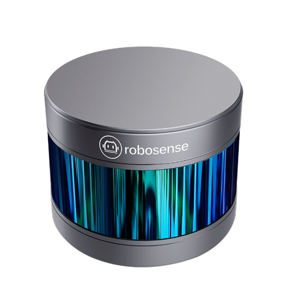
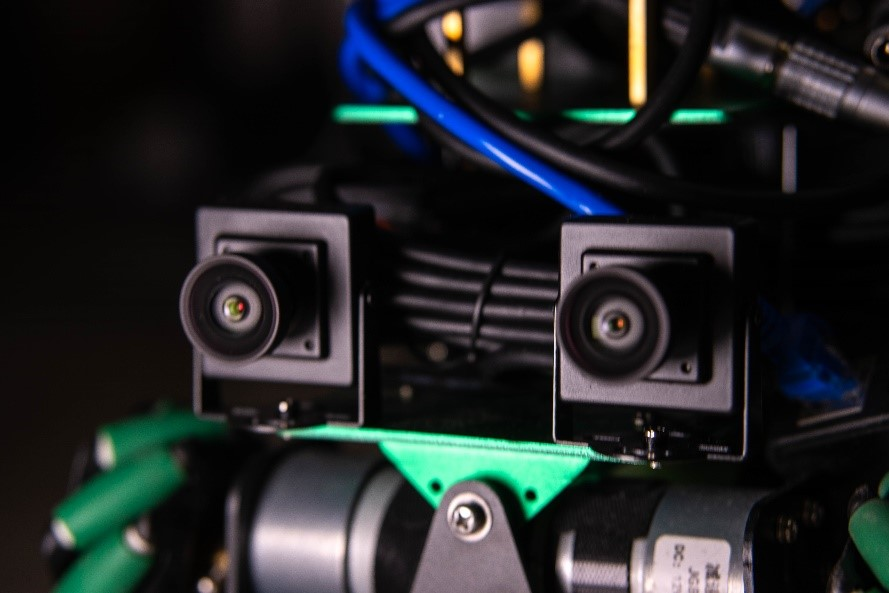
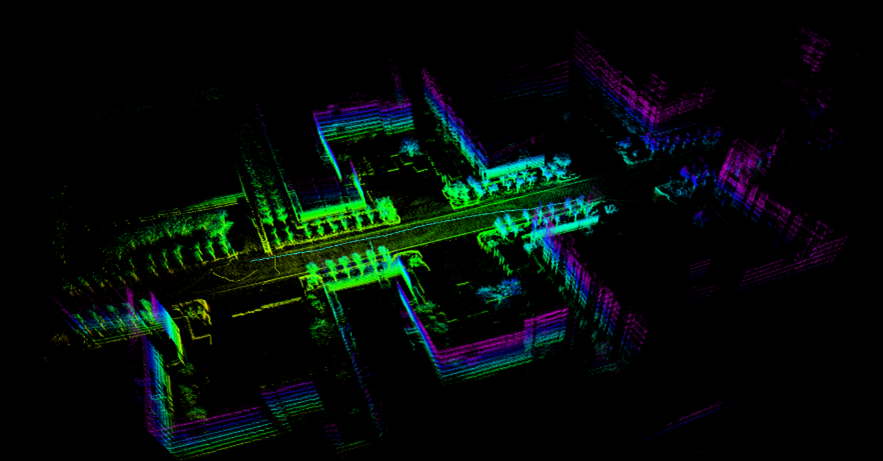
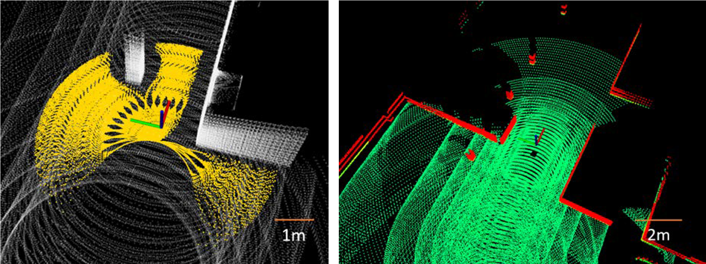

# Project Overview
The core of this project is to develop an autonomous driving car integrated with various advanced technologies and features. Our goal is to achieve high autonomy and intelligence in various environments. The project is divided into several key modules, including automatic positioning, mapping and navigation, intelligent following module, and Bird's Eye View (To be implemented) perception, among others.

## Technical Highlights
Automatic Positioning and Navigation: Combining sensors like LIDAR, cameras, and IMUs, and utilizing SLAM technology, I achieved precise environmental perception and positioning, laying the foundation for autonomous navigation.

Intelligent Following: Through computer vision technology, I realized intelligent recognition and tracking of pedestrians and drivable spaces.

## Hardware Composition

The success of the project is inseparable from carefully selected hardware components. I used NVIDIA Jetson Nano 4GB as the main controller, STM32F103RCT6 microcontroller as the sub-controller, along with ICM20948 nine-axis IMU chip, and AM2857 motor drive chip, among others. These high-performance hardware components ensure the stability and reliability of the car's system.

## Application of SLAM Technology
SLAM technology played a vital role in this project. I used FasterLIO as the mapping algorithm, ensuring accuracy in real-time mapping. Due to its lightIight nature, it operates efficiently even under limited computational resources.

## Path Planning and Autonomous Exploration

I used the FAR Planner algorithm for path planning and the DSVP algorithm for environmental exploration. These algorithms enable the car to effectively plan paths and autonomously explore in complex environments.

## Conclusion
Through this project, I not only showcased the latest advancements in autonomous driving technology but also provided new perspectives and possibilities for future applications of autonomous driving. As technology continues to advance, I believe autonomous driving cars will play an increasingly important role in various fields.

